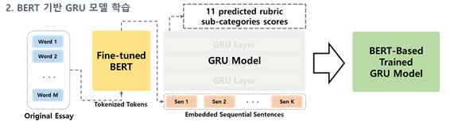
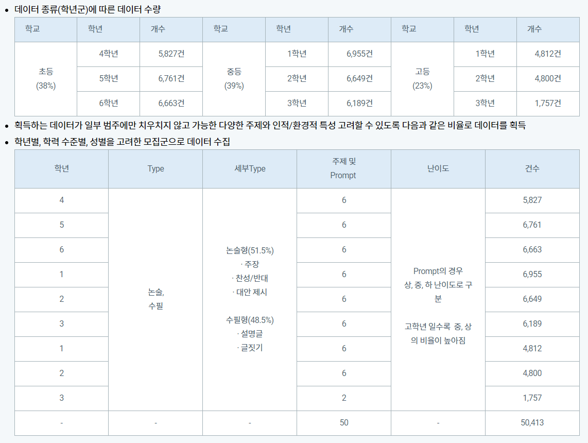
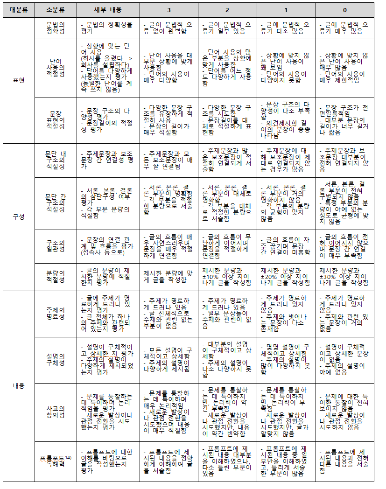
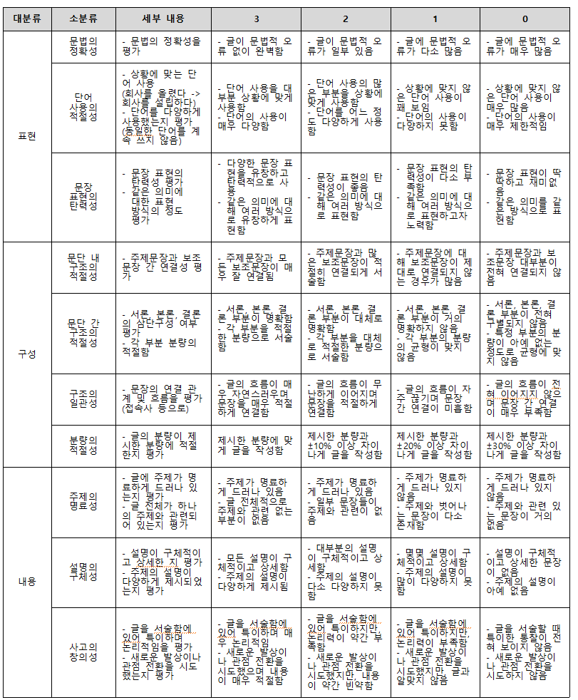

## 📝  한국어 에세이 글 평가 모델
 (AI-hub) 에세이 글 평가 데이터와 소스코드를 활용한 한국어 에세이 자동 평가 모델 성능 측정

[에세이 글 평가 데이터](https://aihub.or.kr/aihubdata/data/view.do?currMenu=115&topMenu=100&aihubDataSe=realm&dataSetSn=545)


## 모델 구조
[monologg/kobert](https://github.com/monologg/KoBERT-Transformers)를 통해 에세이의 문장별 임베딩을 추출한 뒤 GRU에서 임베딩 값을 받아 에세이를 scoring. 총 11개의 평가 기준에 따른 점수를 출력

 

## 코드 구성 (에세이 Embedding 추출)
```bash
python3 aes_embedding.py
```
dataset.csv에 저장된 에세이 원문의 문장별 임베딩 값을 csv 파일에 저장.

## 코드 구성 (Train)
```bash
python3 aes_train.py
```
csv 파일에 저장된 임베딩 값을 tensorflow기반 gru 모델에 입력해 에세이 점수를 학습하고 kappa score, pearson 상관계수를 측정함

## 모델 성능 측정 결과
```
Kappa Score 1 : 0.5587065386538349
Pearson Correlation Coefficient 1 : 0.6135622669936321
```


## 데이터 구조


## Label (rubric) 구성
11가지 평가 기준에 따른 0~3점 사이의 정수 점수로 이루어짐
각 평가기준은 논술형, 수필형에 따라 다름

* 논술형 루브릭 구성

* 수필형 루브릭 구성


각 루브릭 별 가중치에 따라 총점을 계산해 kappa score, pearson correlation 측정